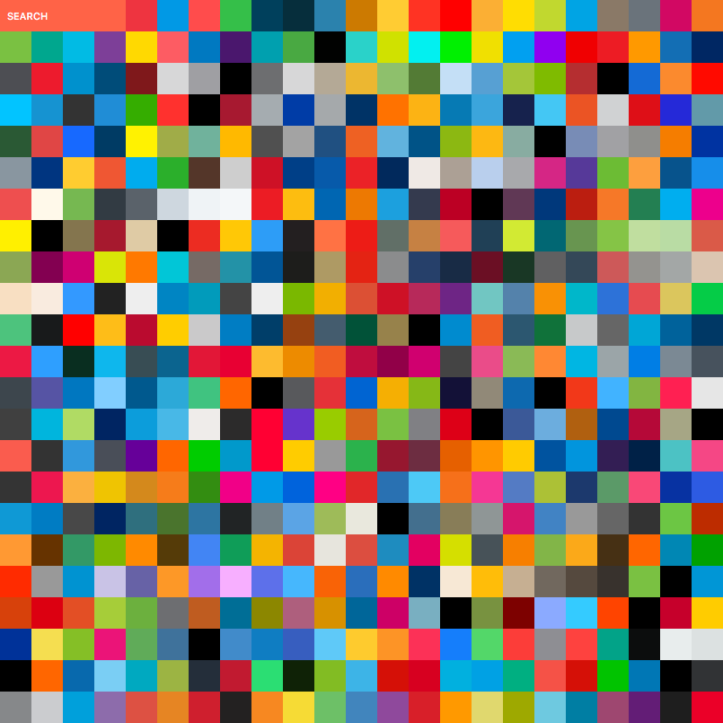

brand-colors is a collection of colors works available in sass, less, stylus and css

## Installation

```
npm install brand-colors
bower install brand-colors
```

## Usage

#### scss
```scss
@import 'bower_components/brand-colors/dist/latest/scss/brand-colors.latest.scss'

.a-div {
  color: $bc-spotify;
}
```
#### less
```css
@import 'bower_components/brand-colors/dist/latest/less/brand-colors.latest.less'

.a-div {
  color: @bc-spotify;
}
```
##### in webpack
  * use relative path to the `node_modules`, for example:
  
  ```js
    app
     |_node_modules
     |_src
        |_css
           |_app.less
  ```
  in app.less:
  
  ```less
  @import '../../node_modules/brand-colors/dist/latest/less/brand-colors.latest.less';
  ```
  
  * use webpack's resolve mechanism
  
  ```less
  @import '~brand-colors/dist/latest/less/brand-colors.latest.less';
  ```
  
#### sass
```sass
@import 'bower_components/brand-colors/dist/latest/scss/brand-colors.latest.sass'

.a-div
  color: $bc-spotify
```
#### stylus
```css
@import 'bower_components/brand-colors/dist/latest/stylus/brand-colors.latest.styl'

.a-div {
  color: $bc-spotify;
}
```
#### css

```html
  <link rel="stylesheet" href="bower_components/brand-colors/dist/latest/css/brand-colors.latest.min.css">`

  <span class="bc-spotify">This text is spotify-green</span>
  <div class="bc-spotify-bg">This div has a spotify-green background</div>
```
#### postcss

Use [postcss-brand-color](https://github.com/postcss/postcss-brand-colors) plugin. Add it to PostCSS:

```js
postcss([ require('postcss-brand-colors') ])
```

and use `*-color` names:

```css
.a-div {
  color: spotify-color;
}
```

### Run brand-colors.com locally
If you want to work on the static homepage, just run the following commands
and you will get a live-reloading server listening for changes in /app
and brandColors.js
```bash
npm install
gulp dev
```
### Brands
[Full list of colors](https://github.com/reimertz/brand-colors/blob/master/data/brandColors.js#L8)
A lot fo the colors comes from brandcolors.net, so a huge shout out to @galengidman.

---
> [reimertz.co](http://reimertz.co) &nbsp;&middot;&nbsp;
> GitHub [@reimertz](https://github.com/reimertz) &nbsp;&middot;&nbsp;
> Twitter [@reimertz](https://twitter.com/reimertz)
